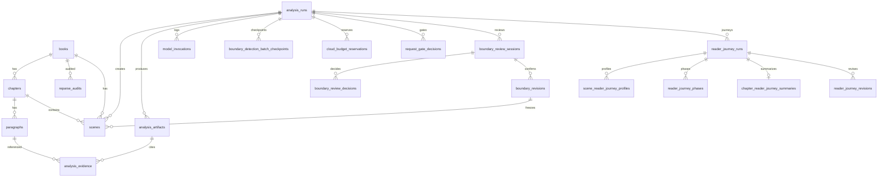

# 06 — Database Design

**ORM：** `apps/api/app/db/models.py`  
**引擎：** SQLite（默认 `data/storylens.db`）  
**迁移：** `session.py` 内幂等 ALTER（非 Alembic 修订树）

## ER 图（Markdown）

---

## 表定义

### books

| 字段 | 类型 | 用途 |
|------|------|------|
| id | int PK | 书籍 ID |
| title / author | string | 元数据 |
| source_file_name / source_file_hash | string | 来源与去重 |
| import_status / language | string | 导入状态 / 语言 |
| source_content | blob? | 原始文件 |
| import_diagnostics_json | text | 导入诊断 |
| import_warning | string? | 警告码 |
| revision_of_book_id / revision_number | FK/int | 重解析修订链 |
| fixture_name / fixture_version | string? | 测试夹具 |
| created_at | datetime | 创建时间 |

### chapters

| 字段 | 类型 | 用途 |
|------|------|------|
| id | int PK | 章节 ID |
| book_id | FK | 所属书 |
| chapter_index | int | 顺序 |
| title / display_title / chapter_title / source_title_line | string | 标题族 |
| start/end_paragraph_id | string? | 段落范围 |
| word_count | int | 字数 |
| section_type | string | chapter 等 |
| chapter_number_* / chapter_unit | mixed | 编号规范化 |

### paragraphs

| 字段 | 类型 | 用途 |
|------|------|------|
| id | string(32) PK | **稳定段落 ID**（证据引用键） |
| book_id / chapter_id | FK | 归属 |
| paragraph_index | int | 章内序 |
| raw_text / normalized_text | text | 文本 |
| char_start / char_end | int | 源偏移 |
| source_page | int? | 页码（如有） |

### reparse_audits

重解析前后章节数、文件 hash、规则版本审计。

### analysis_runs

| 字段族 | 用途 |
|--------|------|
| task_type / subject_* | 任务与主体 |
| provider / model / prompt_version / schema_version | 冻结调用配置 |
| input_hash / prompt_hash | 可复现性 |
| status / progress_* | 生命周期 |
| error_* / failed_stage / retryable / user_action_hint | 失败定位 |
| execution_mode / analysis_mode / cloud consent | 执行策略 |
| client_request_id | 幂等 |
| recovered_from_run_id / retry_of_run_id | 血缘 |
| raw_output / validated_output | 汇总输出 |

### scenes

场景键 `scene_key`、段落起止 FK、`created_by_run_id`、边界元数据、`boundary_revision_id`。  
UNIQUE(`created_by_run_id`, `scene_key`)。

### analysis_artifacts / analysis_evidence

工件 JSON 载荷 + 按 `field_path` 绑定 `paragraph_id` / `paragraph_hash`。

### model_invocations

完整调用审计：attempt、hashes、raw/parsed、latency、token/cost、HTTP 状态、cloud 标记等。

### boundary_detection_batch_checkpoints

按 `(run_id, batch_index, prompt_version)` 唯一；存 batch JSON 与状态，支持续跑。

### request_gate_decisions / cloud_budget_reservations

预算门禁与分阶段预留/消耗/释放账本。

### provider_configurations / application_settings

Provider 运行时覆盖；全局 KV（cloud_enabled、budget、desktop 等）。

### boundary_review_sessions / decisions / revisions

人工审阅会话、逐 transition 决策、确认后的不可变修订快照。

### reader_journey_runs

旅程状态机、版本字段、场景完成列表 JSON、失败字段、幂等 `client_request_id`。

### scene_reader_journey_profiles

每场景情绪/分数/summary + `payload_json`；可链 `artifact_id`。

### reader_journey_phases

阶段标题、场景序范围、读者问题/情绪/payoff、confidence。

### chapter_reader_journey_summaries

章级摘要、问题链、engagement/hook/risk JSON、诊断字段。

### reader_journey_revisions

预留人工修订（revision_number + payload）。

---

## 关联关系摘要

- 文本主链：`books → chapters → paragraphs`
- 分析主链：`analysis_runs → scenes / artifacts / invocations`
- 审阅链：`analysis_runs → review_session → decisions → revision → scenes`
- 旅程链：`analysis_runs → reader_journey_runs → profiles/phases/summary`
- 证据链：`artifacts → evidence → paragraphs.id`
