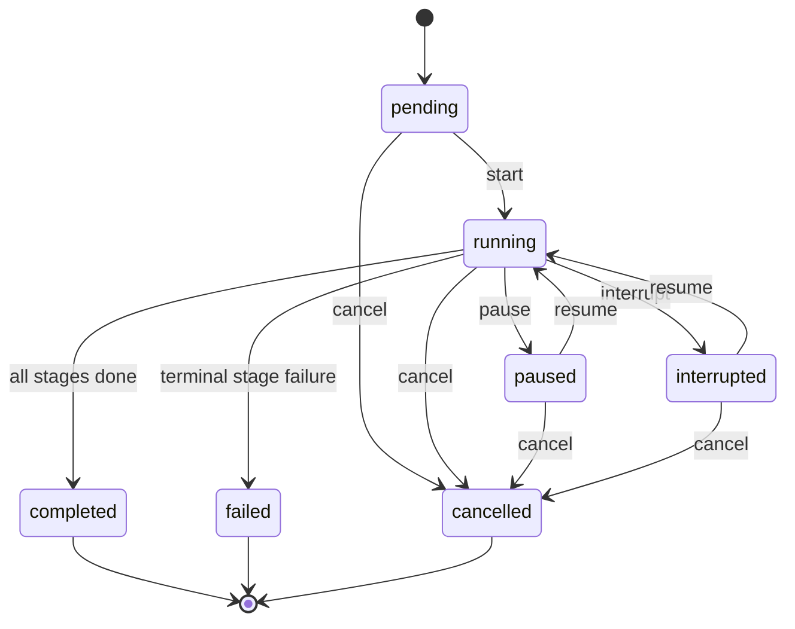

# Phase 1D-P Product Flow

Frozen whole-book analysis product principles, user flow, and state/page diagrams.  
Change: `CHG-20260723-026`. No real Run creation; no model calls.

## 20 Product Principles

1. 用户启动分析前必须先经过 Preflight。
2. Preflight 与真实 Run 创建必须分离（Preflight ≠ Run creation）。
3. 当前真实 Run 创建继续禁用（`WHOLE_BOOK_RUNS_ENDPOINT_DISABLED=true`）。
4. Native / Enhanced 是分析**模式**，不是不同订阅产品。
5. 用户可选择分析模块，系统必须自动补齐必要依赖。
6. 整书正文始终是第一事实源。
7. Enhanced 模式只能把章节资产作为辅助信息。
8. 结果页必须支持部分结果逐步出现。
9. 单个阶段失败不能使已完成模块消失。
10. 每个分析结论必须可追溯到 Evidence。
11. 模型输出默认是 candidate。
12. 用户确认、纠正和锁定必须通过 Phase 1B 资产底座完成。
13. 用户确认内容不得被新 Run 自动覆盖。
14. Pattern Map 是资产和关系的投影，不建立第二套事实。
15. 前端不得直接解释模型原始 JSON。
16. 所有结果必须经过稳定 DTO。
17. 公共资产查看和人工维护不进行 Pro gating。
18. 自动整书分析运行仍属于 `whole_book_analysis` Capability。
19. 第一版不要求一次实现全部分析模块。
20. 不得针对某一篇小说设计特定模块或特殊判断。

## 20-Step User Flow

1. 用户进入书籍工作台（Book Workbench）
2. 选择「整书分析」
3. 系统进入 Preflight（只读检查，不创建 Run）
4. 检查书籍、Snapshot、Capability、Quota、Engine
5. 用户选择 Native 或 Enhanced（mode，非 product）
6. 用户选择分析模块
7. 系统展示阶段计划与限制（含自动补齐依赖说明）
8. 用户确认
9. **当前版本**：真实入口禁用 → 不创建生产 Run
10. （后续启用后）创建 Book Scope Run
11. 初始化 RunStage
12. 展示阶段进度
13. 支持暂停、恢复、重试、取消
14. 已完成模块可提前查看（partial results）
15. 全部阶段完成后进入结果总览
16. 用户查看 Evidence
17. 用户确认 / 纠正 / 拒绝 / 锁定结论
18. 冲突进入 Conflict Center
19. Pattern Map 消费 canonical Asset/Relation（投影，无 Pattern 表）
20. 新 Run 产生新候选，不覆盖锁定内容

## Run Status State Machine

Statuses: `pending` | `running` | `paused` | `interrupted` | `completed` | `failed` | `cancelled`

Notes:

- Stage 状态继续使用 Phase 1A（含 `skipped`）。
- `allowed_actions` 由后端返回，前端不自行推导。
- 详见 [phase1d-run-progress-contract.md](./phase1d-run-progress-contract.md)。

## Page Flow

Hard gates this phase:

| Gate | Value |
|------|-------|
| Preflight creates Run? | **No** |
| `WHOLE_BOOK_RUNS_ENDPOINT_DISABLED` | `true` |
| `PRO_CAPABILITIES_SHIPPED` | `false` |
| Native / Enhanced | modes only |

See also: [phase1d-preflight-page-contract.md](./phase1d-preflight-page-contract.md), [phase1d-api-contract.md](./phase1d-api-contract.md).
