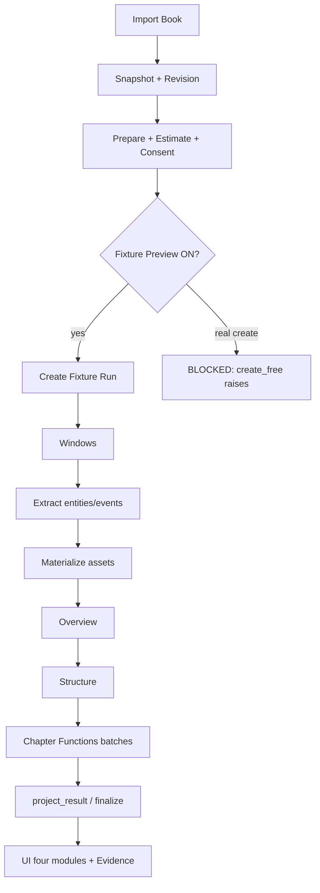

# CURRENT_E2E_PIPELINE — CHG-20260803-045

## Scope freeze (confirmed)
FEATURE DEVELOPMENT COMPLETE：**YES** · END：**WB-2.2** · Free modules：**4** · No new modules in Wave 1.

## Formal intended path

```text
Import book
→ Immutable Snapshot / Revision hash
→ Prepare (dual route alias)
→ Cost Estimate
→ Consent (revision-bound)
→ Create Run (idempotent)
→ Window planning
→ Entity/Event extraction  (== characters_events source)
→ Asset materialization
→ synthesize_overview
→ synthesize_structure_stages
→ synthesize_chapter_functions (batched)
→ project_result / finalize
→ completed | partial | insufficient | failed | canceled
→ Read four Free modules + Evidence deep link
→ Confirmed no-overwrite / conflict
→ Refresh / reentry / restart recovery
```

## Stage matrix

| Stage | Status | Evidence |
|---|---|---|
| Import / Snapshot / Revision | ALREADY COMPLETE | `whole_book_snapshot_v1_service.py`; prepare returns `book_revision_hash` |
| Prepare dual paths | ALREADY COMPLETE | `whole_book_free_product_router` + CHG-030 alias tests |
| Cost Estimate | PARTIALLY COMPLETE | `whole_book_cost_estimate_service.py` L155–156：`window_count + 3`；未按 CF batch/repair 展开 |
| Consent | ALREADY COMPLETE | `whole_book_consent_service.py` revision 校验 |
| Create Run — Fixture | ALREADY COMPLETE | `create_fixture_free_whole_book_analysis_v1` |
| Create Run — Real Provider | MISSING | `create_free_whole_book_analysis_v1` 显式 raise（L178–186） |
| Provider Unit Planning / Windows | ALREADY COMPLETE | `generate_whole_book_windows_v1` in fixture create |
| characters_events（extraction+materialize） | ALREADY COMPLETE（同 Run） | `execute_fixture_minimal_pipeline_v1` L72–73；非独立 synthesize stage |
| overview | ALREADY COMPLETE | `synthesize_minimal_book_overview_v1` |
| structure | ALREADY COMPLETE | `synthesize_minimal_structure_stages_v1` |
| chapter_functions | ALREADY COMPLETE | `synthesize_minimal_chapter_functions_v1`；batch unit keys |
| project_result | PARTIALLY COMPLETE | structure/CF finalize 写入 `project_result`/`finalize`；缺跨四模块统一投影验收 |
| Terminal statuses | PARTIALLY COMPLETE | fixture modes + WB-2.1/2.2 tests；缺正式页跨模块矩阵 |
| Evidence deep link | PARTIALLY COMPLETE | `wholeBookFreeEvidenceDeepLink.ts`；overview/chars returnModule 不完整 |
| Confirm / Conflict | ALREADY COMPLETE（服务层） | WB-1.10 / structure conflict paths |
| Refresh / Reentry | PARTIALLY COMPLETE | URL `module=` + CF restore*；缺完整 Playwright |
| Restart recovery | PARTIALLY COMPLETE | prepare `recoverable_run`；缺 whole-book sidecar 重启隔离测 |
| Dev harness isolation | PARTIALLY COMPLETE | router `import.meta.env.DEV`；缺 production build 证明 |
| Real Provider E2E | DEV-ONLY / OUT OF WAVE 1 EXEC | Wave 3；本 Wave Fake/Fixture only |

## Pipeline diagram (fixture Free)



## Verdict
Fixture 路径上四模块可同 Run 跑通；**正式真实 Provider 创建路径缺失**。Wave 1 目标是稳定化现有正式链路（含 Fake/Fixture 与状态机），不为 Wave 3 提前开放真实模型，但须把 create-path 缺口与费用粒度标为发布链风险。
